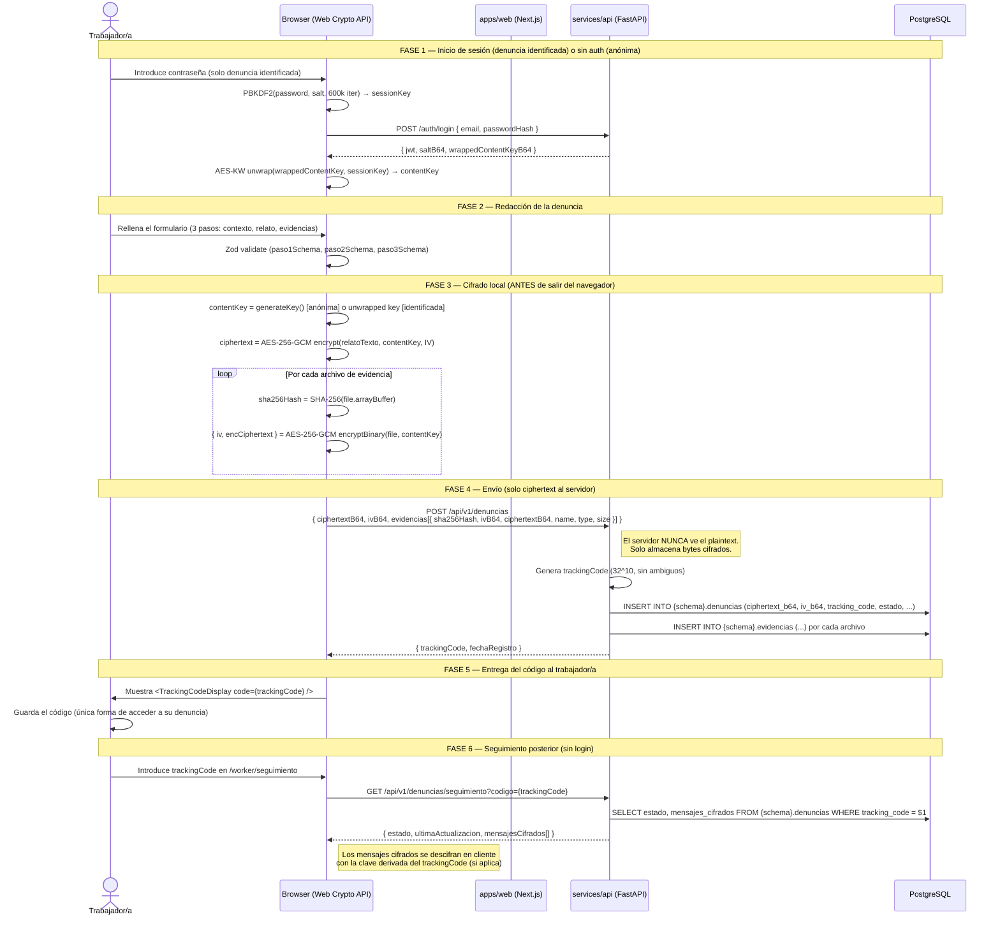

# Flujo end-to-end de una denuncia cifrada

## Diagrama de secuencia



## Modelo de claves para denuncia anónima

```
trackingCode (32 chars, visible al usuario)
     │
     └─► PBKDF2(trackingCode, salt_fijo_por_tenant, 600k iter)
              │
              └─► anonymousContentKey (AES-256)
                       │
                       ├─► encrypt(relato) → ciphertext almacenado en PG
                       └─► encryptBinary(evidencia) → ciphertext almacenado en PG
```

El servidor almacena el `salt_fijo_por_tenant` (no secreto), el ciphertext y el IV.
**Nunca** almacena la clave derivada ni el plaintext.

## Modelo de claves para denuncia identificada

```
password del usuario
     │
     └─► PBKDF2(password, salt_usuario, 600k iter) → sessionKey
              │
              └─► AES-KW unwrap(wrappedContentKey) → contentKey
                       │
                       ├─► encrypt(relato) → ciphertext
                       └─► encryptBinary(evidencia) → ciphertext
```

El `wrappedContentKey` (envuelto con sessionKey) se almacena en PG junto al usuario.
Si el usuario cambia su contraseña, se re-genera sessionKey y se re-envuelve contentKey.

## Garantías legales cubiertas

| Requisito | Cómo se cubre |
|---|---|
| Ley 2/2023 art. 16 — anonimato garantizado | El servidor no puede identificar al denunciante anónimo |
| RGPD art. 25 — privacidad por diseño | Cifrado E2E; servidor procesa solo ciphertext |
| Ley 2/2023 art. 9 — confidencialidad | Incluso los administradores de BD no pueden leer denuncias |
| Integridad de evidencias | SHA-256 del original guardado y verificable |
