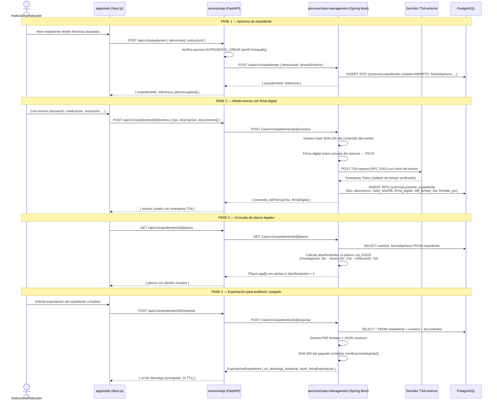
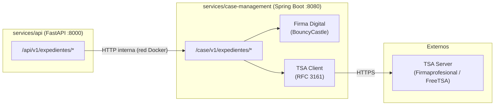

# Flujo de gestión de expedientes — M5

## Diagrama de secuencia

## Comunicación API ↔ Case-Management

La comunicación entre `api` y `case-management` es **interna** (red Docker, no expuesta).
Solo `Nginx` expone puertos al exterior.

## Plazos legales implementados (Ley 2/2023)

| Plazo | Duración | Artículo | Alerta en |
|---|---|---|---|
| Acuse de recibo al denunciante | 7 días hábiles | Art. 19 | 5 días |
| Investigación | 3 meses (extensible) | Art. 20 | 15 días antes |
| Resolución y comunicación | 10 días hábiles desde resolución | Art. 22 | 5 días |
| Conservación del expediente | 10 años | Art. 24 | — |

## Tipos de evento del expediente

| Tipo | Requiere firma | Requiere TSA |
|---|---|---|
| `APERTURA` | Sí | Sí |
| `NOTIFICACION_DENUNCIANTE` | Sí | Sí |
| `ACTUACION_INVESTIGADORA` | Sí | Sí |
| `TESTIGO_ENTREVISTADO` | Sí | Sí |
| `PRUEBA_INCORPORADA` | Sí | Sí |
| `CONCLUSION_INVESTIGACION` | Sí | Sí |
| `RESOLUCION` | Sí | Sí |
| `MEDIDA_CAUTELAR` | Sí | Sí |
| `ARCHIVO` | Sí | Sí |
| `COMENTARIO_INTERNO` | No | No |
