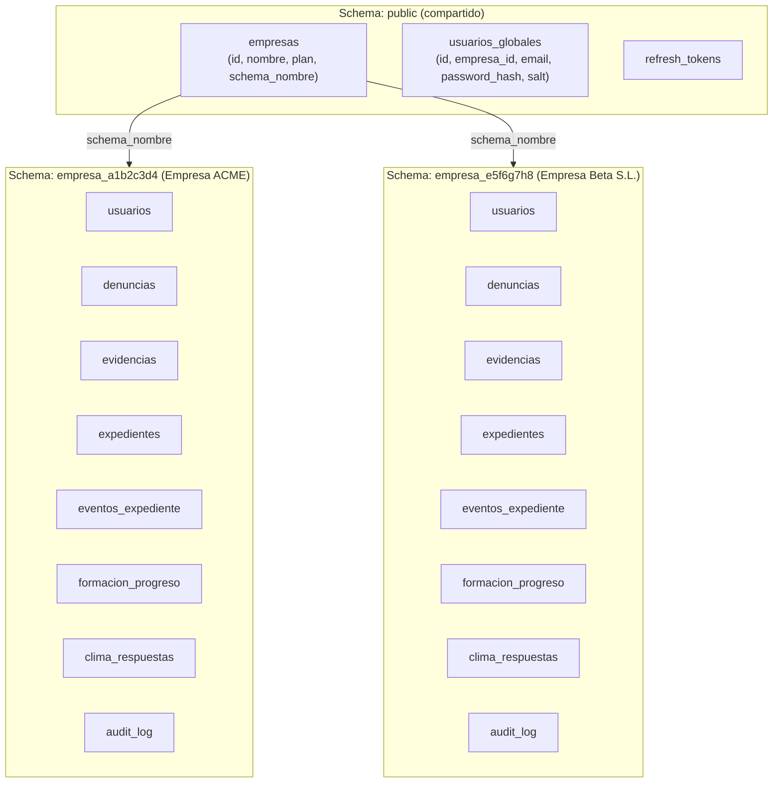
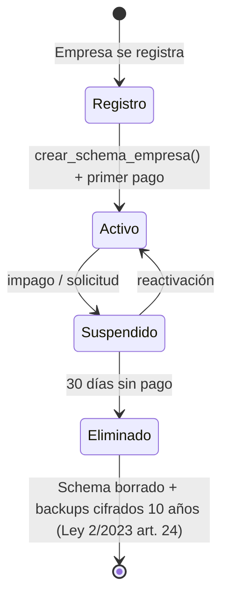
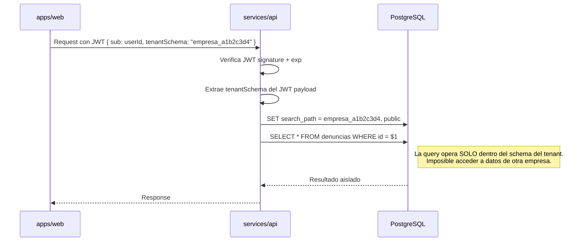

# Aislamiento multi-tenant — SafeWork AI

## Estrategia: schema por empresa en PostgreSQL

Cada empresa cliente tiene su propio **schema PostgreSQL** con prefijo `empresa_{id}`.
Todos los datos operativos (denuncias, expedientes, usuarios, etc.) viven dentro de ese schema.
La tabla global `public.empresas` y `public.usuarios_globales` solo contienen metadatos de tenant y credenciales de login.



## Función de creación de schema

`crear_schema_empresa(p_empresa_id UUID)` — función PL/pgSQL en `database/schemas/001_init.sql`:

1. Genera `schema_nombre = 'empresa_' || replace(p_empresa_id::text, '-', '')[:8]`
2. Ejecuta `CREATE SCHEMA IF NOT EXISTS {schema_nombre}`
3. Crea todas las tablas dentro del schema: usuarios, denuncias, evidencias, expedientes, eventos_expediente, mensajes_denuncia, formacion_*, clima_*, audit_log
4. Crea índices por (empresa_id, estado, created_at)
5. Configura RLS policies (Row Level Security) adicional como defensa en profundidad

## Row Level Security (defensa en profundidad)

Aunque el código siempre usa `SET search_path = empresa_{id}` antes de cada query, las tablas también tienen RLS activado como segunda capa:

```sql
-- Ejemplo para tabla denuncias
ALTER TABLE denuncias ENABLE ROW LEVEL SECURITY;
CREATE POLICY tenant_isolation ON denuncias
  USING (current_setting('app.current_schema') = current_schema());
```

Esto impide que un bug de aplicación permita leer datos cross-tenant incluso si se olvida el `SET search_path`.

## Ciclo de vida de un tenant



## Cómo se resuelve el schema en cada request



## Planes y límites por tenant

| Plan | Usuarios máx. | Almacenamiento | Módulos |
|---|---|---|---|
| `starter` | 50 | 5 GB | M1, M2, M3 |
| `professional` | 500 | 50 GB | M1–M7 |
| `enterprise` | Sin límite | 500 GB | M1–M8 + SLA + integración HR |

Los límites se comprueban en middleware FastAPI antes de permitir escrituras.

## Aislamiento de datos de clima laboral (k-anonimato)

Las encuestas de clima (`clima_respuestas`) **no almacenan** `usuario_id`.
Se guardan solo: `empresa_id`, `encuesta_id`, `respuestas` (JSON), `created_at` (solo fecha, no hora).
Se requiere mínimo **k=5** respuestas por segmento para mostrar resultados (protección estadística).
