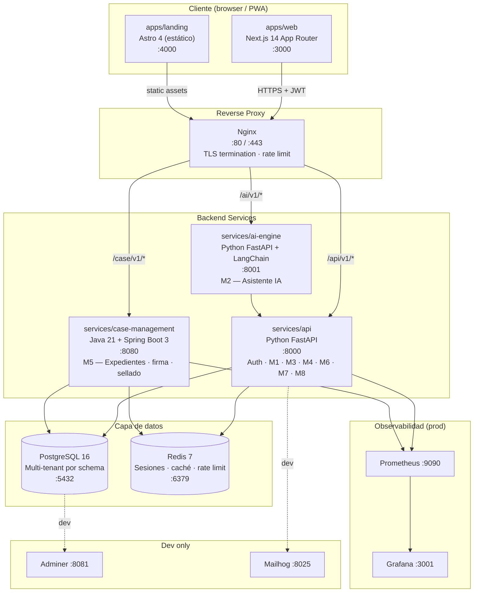

# Arquitectura general — SafeWork AI

## Diagrama de bloques

## Responsabilidades por servicio

| Servicio | Tecnología | Módulos | Puerto |
|---|---|---|---|
| `apps/web` | Next.js 14, Tailwind, React | Todos los módulos (frontend) | 3000 |
| `apps/landing` | Astro 4 (estático) | Marketing, precios, legal | 4000 |
| `services/api` | Python 3.12, FastAPI, SQLAlchemy | M1 M3 M4 M6 M7 M8 + Auth | 8000 |
| `services/ai-engine` | Python 3.12, FastAPI, LangChain, Anthropic | M2 — Asistente IA | 8001 |
| `services/case-management` | Java 21, Spring Boot 3 | M5 — Expedientes, firma digital, TSA | 8080 |
| PostgreSQL 16 | Multi-tenant por schema | Todos los datos persistentes | 5432 |
| Redis 7 | In-memory | Sesiones, caché, rate limiting | 6379 |

## Paquetes compartidos (`packages/`)

| Paquete | Consumidores | Contenido |
|---|---|---|
| `@safework/config` | todos | ESLint, TypeScript, Tailwind, Prettier |
| `@safework/shared-types` | web, api (via openapi-ts) | Tipos TypeScript + schemas Zod |
| `@safework/crypto` | web, api | AES-256-GCM, PBKDF2, AES-KW, SHA-256 |
| `@safework/ui-kit` | web | Primitivos React + componentes de dominio |

## Decisiones de diseño clave

| Decisión | Alternativa descartada | Motivo |
|---|---|---|
| Multi-tenant por schema PostgreSQL | Base de datos separada por empresa | Menor coste operativo; aislamiento suficiente para Ley 2/2023 |
| E2E encryption en cliente (Web Crypto) | Cifrado solo en servidor | El servidor no puede leer denuncias anónimas; requisito legal |
| Java para M5 | Python para todo | Ecosistema maduro para firma digital (BouncyCastle), sello de tiempo TSA |
| Astro para landing | Next.js para todo | Zero JS por defecto; SEO perfecto; desacoplado del ciclo de releases de la app |
| Redis para sesiones | JWT stateless puro | Permite invalidación inmediata (revocación de acceso, ley de protección de datos) |
